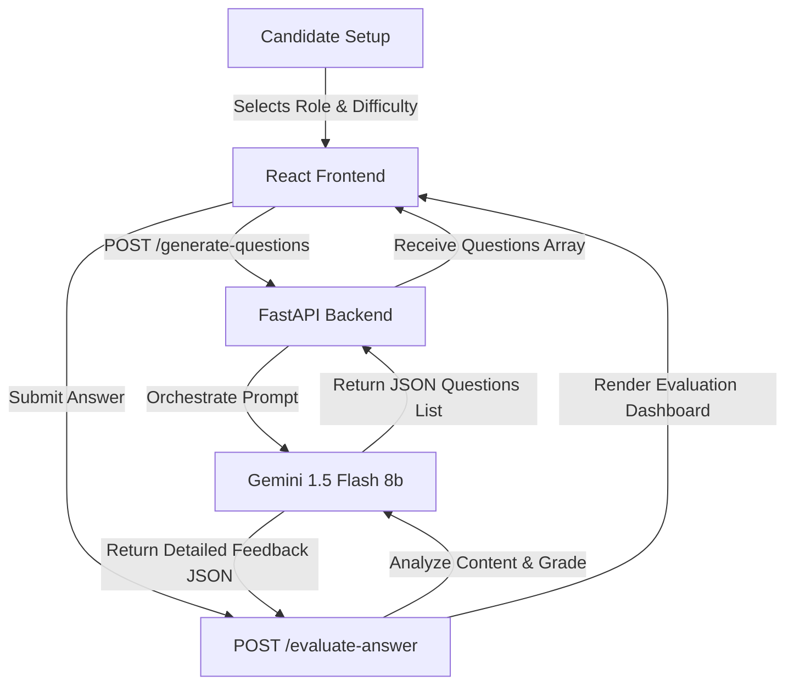

# 🎭 MockForge

[](LICENSE)
[](https://www.python.org/)
[](https://fastapi.tiangolo.com/)
[](https://deepmind.google/technologies/gemini/)
[](https://react.dev/)

> **"Practice makes perfect. MockForge leverages Google's Gemini LLMs to simulate production-grade technical interviewers, providing real-time evaluation, scoring, and tailored feedback."**

MockForge is an AI-powered simulation platform for technical interviews. It generates role-specific interview questions, analyzes typed candidate responses, scores answers from 1-10, and presents actionable recommendations for improvement.

---

## 🗺️ Architectural Workflow



---

## ✨ Features

- **Dynamic Question Synthesis**: Role-specific, difficulty-tuned question generation utilizing structured LLM outputs.
- **Detailed Scoring Matrix**: Immediate grading from 0 to 10 on correctness, depth, and domain knowledge.
- **Micro-Feedback System**: Separates strong points, areas of improvement, and concrete advice in 2-3 sentences.
- **Minimalist Modern Dark UI**: Sleek terminal-inspired UI themed around clean, zero-distraction focus.

---

## 📂 Repository Structure

```
mockforge/
├── frontend/          # React + Tailwind + Vite Interface
├── backend/           # Python FastAPI Server
└── README.md
```

---

## ⚙️ Configuration & Environment Setup

Create a `.env` file in the `backend/` directory:

```bash
GEMINI_API_KEY=your_google_gemini_api_key
```

---

## 🚀 Running mockforge locally

### 1. Backend Server Setup
Requires Python 3.10+.

```bash
cd backend
# Create virtual environment
python -m venv venv
source venv/bin/activate  # On Windows: venv\Scripts\activate

# Install dependencies
pip install -r requirements.txt

# Start backend server
python -m uvicorn main:app --port 8000 --reload
```

Backend API will be running on `http://localhost:8000`. You can inspect Swagger schemas at `http://localhost:8000/docs`.

### 2. Frontend Dashboard Setup

```bash
cd frontend
# Install dependencies
npm install

# Start local server
npm run dev
```

Open `http://localhost:5173/` to practice your interviews.

---

## 🤝 License

Distributed under the [MIT License](LICENSE).
